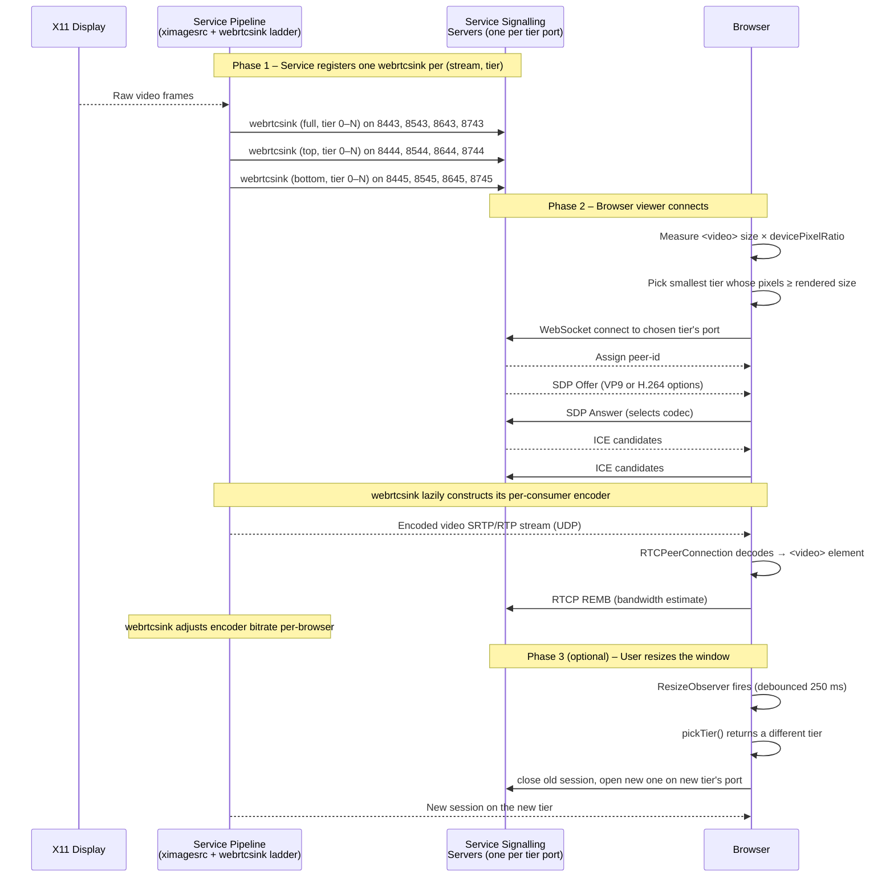

# GStreamer Pipeline Documentation

This document describes every element in the GStreamer pipeline used by the
service container, and traces the full WebRTC signalling and media flow from
X11 screen capture to a viewer's browser.  It also covers the HTTP web server
that serves the archive download and video-assembly endpoints.

---

## End-to-End Architecture

```
┌──────────────────────────────────────────────────────────────────────────┐
│  SERVICE CONTAINER                                                       │
│                                                                          │
│  GPU path (preferred, taken when libgstnvcodec.so loads):                │
│  ximagesrc → videorate → cudaupload → cudaconvertscale → tee             │
│                                                       ├─ q_arch → nvcudah264enc / nvh264enc │
│                                                       │          → h264parse │
│                                                       │          → splitmuxsink (mp4mux, fragmented) │
│                                                       │   (live .mp4 renamed → .mp4 on rotation, │
│                                                       │    no remux — fragmented MP4 throughout) │
│                                                       └─ q_webrtc → tee_webrtc │
│                                                                  ├─ × N tiers of  full-stream branches  │
│                                                                  │   (queue → cudascale → capsfilter(CUDA) → webrtcsink) │
│                                                                  └─ × N tiers of  per-screen   branches │
│                                                                      (queue → cudadownload → videocrop → cudaupload → cudascale → capsfilter(CUDA) → webrtcsink) │
│                                                                          │
│  CPU fallback (when gst-cuda is not available):                          │
│  ximagesrc → videorate → videoscale → videoconvert → tee → ... (videoscale / videocrop+videoscale per tier) │
│                                                                          │
│  gst-webrtc-signalling-server: one per (stream, tier) pair               │
│      default ports: 8443/8543/8643/8743 (full × 4 tiers)                 │
│                     8444/8544/8644/8744 (top  × 4 tiers)                 │
│                     8445/8545/8645/8745 (bottom × 4 tiers)               │
│  HTTP web server (:8080)                                                 │
└──────────────────────────────────────────────────────────────────────────┘
                        │ WebRTC (SRTP/RTP + WebSocket)
                        ▼
              Browser (RTCPeerConnection + <video>)
```

---

## WebRTC Signalling and Connection Sequence


```mermaid
sequenceDiagram
    participant X11 as X11 Display
    participant SvcPipe as Service Pipeline<br/>(ximagesrc + webrtcsink ladder)
    participant SvcSig as Service Signalling<br/>Servers (one per tier port)
    participant Browser

    note over SvcPipe,SvcSig: Phase 1 – Service registers one webrtcsink per (stream, tier)
    X11-->>SvcPipe: Raw video frames
    SvcPipe->>SvcSig: webrtcsink (full,  tier 0–N)  on 8443, 8543, 8643, 8743
    SvcPipe->>SvcSig: webrtcsink (top,   tier 0–N)  on 8444, 8544, 8644, 8744
    SvcPipe->>SvcSig: webrtcsink (bottom, tier 0–N) on 8445, 8545, 8645, 8745

    note over SvcSig,Browser: Phase 2 – Browser viewer connects
    Browser->>Browser: Measure <video> size × devicePixelRatio
    Browser->>Browser: Pick smallest tier whose pixels ≥ rendered size
    Browser->>SvcSig: WebSocket connect to chosen tier's port
    SvcSig-->>Browser: Assign peer-id
    SvcSig-->>Browser: SDP Offer (VP9 or H.264 options)
    Browser->>SvcSig: SDP Answer (selects codec)
    SvcSig-->>Browser: ICE candidates
    Browser->>SvcSig: ICE candidates
    note over SvcPipe,Browser: webrtcsink lazily constructs its per-consumer encoder
    SvcPipe-->>Browser: Encoded video SRTP/RTP stream (UDP)
    Browser->>Browser: RTCPeerConnection decodes → <video> element
    Browser->>SvcSig: RTCP REMB (bandwidth estimate)
    note over SvcPipe: webrtcsink adjusts encoder bitrate per-browser

    note over SvcSig,Browser: Phase 3 (optional) – User resizes the window
    Browser->>Browser: ResizeObserver fires (debounced 250 ms)
    Browser->>Browser: pickTier() returns a different tier
    Browser->>SvcSig: close old session, open new one on new tier's port
    SvcPipe-->>Browser: New session on the new tier
```

---

## Service Pipeline

The pipeline is constructed programmatically (`service/pipeline.py`,
`main()`).

**Pipeline string — GPU path** (equivalent gst-launch form, taken when the
gst-cuda elements are registered; nvidia-container-toolkit injecting
`libcuda.so` is enough — no in-container CUDA-runtime install required):
```
ximagesrc display-name=:0 use-damage=false
  ! videorate
  ! video/x-raw,framerate=30/1
  ! cudaupload
  ! cudaconvertscale
  ! video/x-raw(memory:CUDAMemory),format=NV12,width=1920,height=1080
  ! tee name=t
      t. ! queue ! nvcudah264enc ! h264parse ! video/x-h264,stream-format=avc,alignment=au
              ! splitmuxsink muxer-factory=mp4mux
                             muxer-properties="properties,fragment-duration=(uint)1000"
                             max-size-time=600000000000
         (nvcudah264enc is preferred; falls back to nvh264enc, then to x264enc.
          if x264enc fallback is selected, prepend ! cudadownload before the encoder)
      t. ! queue ! tee name=t_webrtc
          (per WEBRTC_SCALE_LADDER tier, per stream:)
          t_webrtc. ! queue ! cudascale ! capsfilter(W,H,CUDA) ! webrtcsink   (full,  tier i)
          t_webrtc. ! queue ! cudadownload ! videocrop ! cudaupload
                            ! cudascale ! capsfilter(W,H,CUDA) ! webrtcsink   (screen, tier i)
```

**Pipeline string — CPU fallback** (taken when `cudaupload`,
`cudaconvertscale`, `cudascale` or `cudadownload` aren't registered —
typically a CPU-only host with no NVIDIA driver libs available):
```
ximagesrc display-name=:0 use-damage=false
  ! videorate
  ! video/x-raw,framerate=30/1
  ! videoscale
  ! video/x-raw,width=1920,height=1080
  ! videoconvert
  ! tee name=t
      t. ! queue ! encoder ! h264parse ! video/x-h264,stream-format=avc,alignment=au
              ! splitmuxsink muxer-factory=mp4mux
                             muxer-properties="properties,fragment-duration=(uint)1000"
                             max-size-time=600000000000
      t. ! queue ! tee name=t_webrtc
          t_webrtc. ! queue !            videoscale ! capsfilter(W,H) ! webrtcsink   (full,  tier i)
          t_webrtc. ! queue ! videocrop ! videoscale ! capsfilter(W,H) ! webrtcsink  (screen, tier i)
```

The mode is picked once at startup by probing for the four gst-cuda
elements above and is logged as `Pipeline mode : GPU (cuda*)` or
`CPU (videoscale/videoconvert)`.  Every branch sees the same choice; we
deliberately do not mix GPU and CPU element variants within a single run.

### `ximagesrc`

| Property | Value | Purpose |
|---|---|---|
| `display-name` | `:0` | X11 display to capture |
| `use-damage=false` | disabled | Forces full-frame capture on every tick |

Captures raw video frames from the X11 display server. `use-damage=false`
disables the X11 Damage extension, which normally restricts capture to only the
changed screen regions. Disabling it ensures a complete frame is delivered every
tick regardless of X11 damage events, which is required for a stable video
stream.

### `videorate`

Drops or duplicates frames to produce a perfectly constant frame rate. Without
this element, `ximagesrc` output is jitter-prone — frames arrive slightly early
or late depending on system load. `videorate` absorbs that jitter and hands a
steady cadence to the downstream caps filter, preventing encoder stalls and
keeping A/V sync stable.

### Caps filter: `video/x-raw,framerate=30/1`

Locks the frame rate to exactly 30 fps (controlled by `STREAM_FRAMERATE`).
GStreamer uses this caps negotiation step to inform `videorate` of the target
rate. Without an explicit caps constraint here, the downstream elements would
inherit whatever rate `ximagesrc` happens to produce, making the stream
non-deterministic.

### `videoscale`

Resamples the captured frames to the requested output resolution. On a desktop
with a non-standard DPI or multi-monitor setup the raw capture size may not
match the desired stream dimensions. `videoscale` applies a high-quality
bilinear resampler to produce exactly the requested size.

### Caps filter: `video/x-raw,width=1920,height=1080`

Enforces the output resolution (controlled by `STREAM_WIDTH` / `STREAM_HEIGHT`).
Like the framerate caps filter, this is the negotiation contract between
`videoscale` and the next element. GStreamer will reject the pipeline at
link-time if the upstream element cannot produce the specified dimensions,
catching misconfiguration before any frames are processed.

### `videoconvert` (name: `vconvert`)

Converts pixel formats between elements whose capabilities do not match. X11
captures in BGR or BGRA; the downstream encoders expect I420 (YUV planar).
`videoconvert` ensures all downstream elements always see a consistent format
regardless of the source format, preventing caps negotiation failures further
down the pipeline.

### `tee` (name: `t`)

Duplicates the single video stream into two independent branches: the
**archive branch** and the **browser WebRTC branch**. `tee` pushes each buffer
to all downstream sink pads in turn, so both branches receive every frame.

---

### Archive Branch

#### `queue` (name: `q_arch`)

Decouples the `tee` from the encoder.  Configured with explicit bounds and
`leaky=downstream` so the WebRTC branch is isolated from a slow archive
encoder:

| Property | Value | Purpose |
|---|---|---|
| `max-size-buffers` | `0` | Use byte/time gating only |
| `max-size-bytes`   | `ARCHIVE_QUEUE_MAX_BYTES` (default 512 MB) | Bound memory; raw 1080p30 is ~93 MB/s so 512 MB ≈ 5.5 s of headroom |
| `max-size-time`    | `ARCHIVE_QUEUE_MAX_SEC × Gst.SECOND` (default 5 s) | Bound time-domain buffering |
| `leaky`            | `2` (downstream) | When full, drop the oldest buffer instead of blocking |

**Why `leaky=downstream` rather than `leaky=0` (block):** a `tee` element's
chain function is synchronous — it pushes each buffer to *all* src pads
before returning.  With `leaky=0`, when `q_arch` filled, the tee push to it
would block, the tee never gets to its push to `q_webrtc`, and after
`q_webrtc` drains downstream the live viewer freezes.  `leaky=downstream`
makes `q_arch.sink.push` return immediately by evicting the oldest buffer,
so the tee continues to `q_webrtc` without delay.  The cost is that a
sustained archive encoder lag produces visible jumps in the recording; an
`overrun` signal handler in `pipeline.py` logs a debounced warning when this
happens (at most one message per 30 s) so the operator can act.

Setting `ARCHIVE_QUEUE_MAX_BYTES=0` and `ARCHIVE_QUEUE_MAX_SEC=0` reverts to
the legacy unbounded behaviour: zero archive frame loss, but the queue can
grow without limit if the encoder cannot keep up.

#### `nvcudah264enc` / `nvh264enc` / `x264enc` (name: `arch_enc`)

Re-encodes the raw decoded video to H.264 for the archive.  The encoder
factory is selected at runtime (`build_archive_encoder()`) by walking a
preference list and picking the first factory that is registered:

1. **`nvcudah264enc`** — CUDA-context-aware NVENC.  Shares the gst-cuda
   buffer pool with upstream `cudaupload`/`cudaconvertscale`, so the
   handoff into the encoder reuses the same CUDA context without an
   internal rebind.  Present on gst-plugins-bad ≥ 1.22.
2. **`nvh264enc`** — original NVENC element.  Still consumes CUDAMemory
   natively but predates the unified CUDA memory model.
3. **`x264enc`** — software fallback.  Used when no NVENC element is
   registered (typically a CPU-only host).

Both NVENC variants share the same property API and receive the same
configuration dict; the table rows below labelled `nvh264enc` apply to
`nvcudah264enc` as well.

`ARCHIVE_QUALITY` selects between three modes:

**`ARCHIVE_QUALITY=visually-lossless`** *(default)* — constant-quantizer
encoding at `ARCHIVE_QP` (default 18).  Indistinguishable from the source
on screen content; ~2-4× the file size of `legacy` mode.

| Encoder | Property | Value | Purpose |
|---|---|---|---|
| `nvh264enc` | `rc-mode` | `constqp` | Quality-targeted (not bitrate-targeted) |
| `nvh264enc` | `qp-const{,-i,-p,-b}` | `ARCHIVE_QP` | All QP knobs at the configured value (build-version compat) |
| `nvh264enc` | `preset` | `hq` | High-quality preset — archive has no latency requirement |
| `nvh264enc` | `bframes` | `2` | B-frames improve compression on screen content |
| `nvh264enc` | `gop-size` | `30` | Keyframe interval (one IDR per second at 30 fps) |
| `x264enc`   | `pass` | `4` (quant) | Constant quantizer at `ARCHIVE_QP` |
| `x264enc`   | `quantizer` | `ARCHIVE_QP` | Constant QP value |
| `x264enc`   | `tune` | `0x4` (zerolatency) | Same as legacy mode — see note below |
| `x264enc`   | `speed-preset` | `1` (ultrafast) | Same as legacy mode |
| `x264enc`   | `key-int-max` | `30` | Same as legacy mode |

**`ARCHIVE_QUALITY=lossless`** — true lossless (QP=0).  Files can be very
large (50–200 Mbps during heavy motion); set `ARCHIVE_MAX_BYTES`.

| Encoder | Property | Value |
|---|---|---|
| `nvh264enc` | `rc-mode` | `constqp` |
| `nvh264enc` | `qp-const{,-i,-p,-b}` | `0` |
| `nvh264enc` | `preset` | `hq` |
| `nvh264enc` | `bframes` | `2` |
| `nvh264enc` | `gop-size` | `30` |
| `x264enc`   | `pass` | `4` (quant — true CQP) |
| `x264enc`   | `quantizer` | `0` |
| `x264enc`   | `qp-min` / `qp-max` | `0` / `0` |
| `x264enc`   | `tune` | `0x4` (zerolatency) |
| `x264enc`   | `speed-preset` | `1` (ultrafast) |
| `x264enc`   | `key-int-max` | `30` |

**Why `x264enc` keeps the legacy latency tunings while NVENC takes the
slower preset:** an earlier draft dropped `tune=zerolatency` /
`speed-preset=ultrafast` from `x264enc` (pushing it to
`speed-preset=faster` / `pass=qual` / `qp-min=0`) at the same time as
swapping `nvh264enc` to `preset=high-quality`.  CI surfaced a hang — the
archive encoder never produced its first buffer, so the pipeline got
stuck in PAUSED and `splitmuxsink` never opened a segment.  Bisecting in
the test docs narrows the cause to the `x264enc` change (suspected
`qp-min=0` + `pass=qual` interaction); the NVENC path was never
implicated.  So `x264enc` stays on the legacy negotiation path while
`nvcudah264enc`/`nvh264enc` are free to use `preset=hq` + `bframes=2`
for better compression at the same QP.

**Why there is no bitrate cap on CQP modes:** NVENC's `max-bitrate`
property is only honored under `rc-mode=vbr*`/`cbr*`.  Under `constqp`
the encoder emits whatever bitrate the configured QP dictates; setting
`max-bitrate` is a silent no-op.  Earlier docs advertised an
`ARCHIVE_BITRATE_CAP` knob; it never actually capped anything, so it has
been removed.  Operators who need a hard ceiling on archive size should
combine `ARCHIVE_MAX_BYTES` with `ARCHIVE_MAX_AGE_DAYS`, or switch to
`ARCHIVE_QUALITY=legacy` (VBR with `ARCHIVE_BITRATE`).

**`ARCHIVE_QUALITY=legacy`** — byte-for-byte compatible with the
configuration shipped before the archive quality work.  `ARCHIVE_BITRATE`
(default 6000 kbps) is consulted only in this mode.

| Encoder | Property | Value |
|---|---|---|
| `nvh264enc` | `preset` | `low-latency-hq` |
| `nvh264enc` | `rc-mode` | `vbr-hq` |
| `nvh264enc` | `bitrate` / `max-bitrate` | `ARCHIVE_BITRATE` kbps |
| `nvh264enc` | `gop-size` | `30` |
| `x264enc`   | `tune` | `0x4` (zerolatency) |
| `x264enc`   | `speed-preset` | `1` (ultrafast) |
| `x264enc`   | `bitrate` | `ARCHIVE_BITRATE` kbps |
| `x264enc`   | `key-int-max` | `30` |

The archive encoder runs independently of the browser-facing `webrtcsink`
instances and the network — its quality is fixed at the configured QP rather
than reactive to viewer bandwidth.  This means the archived recording always
carries the configured quality, even when individual viewers are throttled.

#### `h264parse` (name: `arch_h264`)

| Property | Value | Purpose |
|---|---|---|
| `config-interval` | `-1` | Inject SPS/PPS before every keyframe |

Parses the raw H.264 byte stream and manages SPS (Sequence Parameter Set) and
PPS (Picture Parameter Set) NAL units. With `config-interval=-1` the SPS/PPS
are repeated before every IDR (keyframe). This is critical for archive
segmentation: each segment must be independently decodable from its first
frame. Without inline SPS/PPS, a segment starting on a non-IDR frame would be
undecodable without seeking back to the previous segment.

`h264parse` is also where the byte-stream → AVCC (length-prefixed)
conversion happens — the caps filter on its src pad pins
`stream-format=avc, alignment=au`, which is what `mp4mux` (downstream)
requires.  Without that explicit caps filter, some GStreamer versions
negotiate Annex-B byte-stream into the muxer and produce broken `avcC`
boxes.

#### `splitmuxsink` (name: `archive`)

| Property | Value | Purpose |
|---|---|---|
| `muxer-factory` | `mp4mux` | Per-segment muxer |
| `muxer-properties` | `fragment-duration=(uint)1000` | Enable fragmented MP4 output |
| `location` | `${ARCHIVE_LIVE_DIR}/{prefix}-%05d.mp4` | Output path for the in-progress segment |
| `max-size-time` | `ARCHIVE_SEGMENT_SEC × Gst.SECOND` | Rotate to a new file every N seconds |

Muxes the H.264 stream into rotating **fragmented MP4** files.
`splitmuxsink` opens a new file automatically when the current segment
reaches the `max-size-time` limit, so no single file grows unboundedly.

**Why fragmented MP4 as the live container?**  Plain MP4 needs its `moov`
atom to be finalised before the file is playable, which means a writer
either has to seek back at EOS (so the file is unplayable mid-write) or
ship two passes (the `+faststart` rewrite).  Fragmented MP4 sidesteps
both: `mp4mux` writes `ftyp + moov(template) + (moof + mdat)*` from the
first encoded buffer onward — moov is at the front from byte zero, each
fragment is self-contained, and the file is naturally readable
mid-write.  Browsers, ffmpeg, and ffprobe all parse it as ordinary MP4
(it's literally the same container format DASH and HLS-CMAF ship).

Concretely on mp4mux:

- **`fragment-duration=1000`** (ms) — each fragment is ~1 s of media,
  which aligns with the 30-frame GOP from the encoder so every fragment
  starts on a keyframe.
- **`streamable=false`** (the default — we leave it unset) — write `moov`
  at the **start** of the file, before any fragments.  Setting
  `streamable=true` would push the `moov` to the end, which is fine for
  live socket streaming but breaks every mid-write reader of the active
  segment (ffmpeg's mov demuxer fails with "moov atom not found" when
  the file ends mid-fragment).  Since we want `/archive` and `/video` to
  serve the in-progress fragment, we explicitly avoid that mode.

The combination keeps the live recording on the "happy path" the moment
splitmuxsink closes a file: it's already a complete, faststart-style,
web-playable MP4.  No remux, no `+faststart` 2-pass, no ffmpeg in the
rotation loop.

#### Post-rotation: rename and move

When `splitmuxsink` rotates a fragment, `pipeline.py` enqueues the
just-completed sequential `.mp4` for renaming on a single background
daemon thread.  The worker shuttles the file into `ARCHIVE_DIR` under
its timestamp-based name, via a `.part` suffix in `ARCHIVE_DIR` so the
`*.mp4` glob never matches a partially-copied file:

```
# 1. Move from live_dir/sequential-name into archive_dir/timestamp-name.part.
#    Same-fs: this is an atomic os.rename.  Cross-fs: shutil.move performs
#    a single read+write copy and removes the source on success.
shutil.move(${LIVE}/${prefix}-NNNNN.mp4, ${ARCHIVE}/${name}.mp4.part)

# 2. Atomic rename to the final name.  /archive's *.mp4 glob can now see it.
os.rename(${ARCHIVE}/${name}.mp4.part, ${ARCHIVE}/${name}.mp4)
```

Key properties:

- **No re-encoding, no remux** — the live file is already a complete
  fragmented MP4; rollover just relocates it.  Net I/O floor is one
  read+write across filesystems, or zero data movement when LIVE and
  ARCHIVE are on the same filesystem.
- **Atomic publication** — `ARCHIVE_DIR`'s `*.mp4` glob never matches
  a partial cross-fs copy.  shutil.move writes the bytes under `.part`;
  only the final `os.rename` makes the new segment visible to readers.
- **Background worker** — the `format-location-full` callback returns
  immediately; the cross-fs copy (when applicable) runs off the
  GStreamer streaming thread so slow bulk storage can never stall the
  pipeline.
- **Recovery on failure** — if the move ever fails (disk full,
  permission), the sequential `.mp4` stays in `ARCHIVE_LIVE_DIR` under
  its original name.  `/archive` won't include it under the renamed
  glob, but the operator can recover it manually.

Keeping the live write path on its own filesystem (e.g. tmpfs or a fast
local disk) and the completed archive on a slower bulk volume is
supported transparently — the cross-fs copy and the in-place rename are
both handled correctly.

---

### Segment Naming and Timestamping

Segments are written into `ARCHIVE_LIVE_DIR` with sequential numeric names
(`{prefix}-00000.mp4`, `{prefix}-00001.mp4`, …) as fragmented MP4.  When
a segment is completed it is renamed/moved (no re-encode, no remux) into
`ARCHIVE_DIR` under its final timestamp-based name:

```
{prefix}_YYYYMMDD-HHMMSS.SSS_to_YYYYMMDD-HHMMSS.SSS.mp4
```

**How timestamps are derived:**

The `format-location-full` signal fires on `splitmuxsink` at the start of each
new fragment.  The callback (`_on_format_location_full`) stamps the boundary
with `time.time_ns()`.  This value simultaneously becomes the **end**
timestamp of the just-completed fragment and the **start** timestamp of the
new one — both reads happen in the same callback call, so adjacent segments
abut exactly.  The old fragment is enqueued for finalize (rename/move
on a background worker), with the new name computed by
`archive_times.renamed_segment_path(..., ext='.mp4')`.

On pipeline shutdown (EOS), `format-location-full` does not fire for the
final fragment.  The EOS handler stamps it with `time.time_ns()`, enqueues
it, and waits for the queue to drain so the last segment lands in
`ARCHIVE_DIR` before the process exits.

The timestamp precision is millisecond-level, matching the filename format
`YYYYMMDD-HHMMSS.SSS`.  The start of segment N+1 is always exactly equal to the
end of segment N — there are no gaps or overlaps between adjacent completed
segments.

---

### Archive Retention (Purge)

When either `ARCHIVE_MAX_BYTES` or `ARCHIVE_MAX_AGE_DAYS` is non-zero,
`archive_purge.purge_archive()` runs:

- **At pipeline startup**, before the GLib main loop starts.
- **Every `ARCHIVE_SEGMENT_SEC` seconds** thereafter, scheduled via
  `GLib.timeout_add_seconds`.

The purge logic (`archive_purge.py`):

1. Sorts all `.mp4` files in `ARCHIVE_DIR` (completed segments only) by mtime.
2. Exempts the most recent file as a safety margin so at least one segment
   always survives.  The currently-writing segment lives in
   `ARCHIVE_LIVE_DIR` and is therefore never visible to the purger.
3. If `ARCHIVE_MAX_AGE_DAYS` is set, deletes every remaining file whose mtime
   is older than the cutoff.
4. If `ARCHIVE_MAX_BYTES` is set, deletes the oldest remaining files one by
   one until the total size of surviving files is within the limit.

---

### Browser WebRTC Branch

#### `queue` (name: `q_webrtc`)

Decouples the main `tee` from the browser sub-tree for the same reason as
`q_arch`: prevents browser encoding/network back-pressure from stalling the
archive branch.

#### `tee` (name: `t_webrtc`)

Splits the single decoded stream into N × (1 + screens) parallel browser
feeds, where N is the number of tiers configured by `WEBRTC_SCALE_LADDER`.
Each (stream, tier) pair has its own `webrtcsink` on its own signalling
port, so a browser independently picks the tier whose pixel dimensions
match the size it's actually rendering the `<video>` element at.

#### Per-tier sub-branch

Every (stream, tier) pair shares the same shape, with GPU vs. CPU element
choices following the global pipeline mode:

```
GPU path:
  tee_webrtc → queue → [cudadownload → videocrop → cudaupload]
              → cudascale → capsfilter(W,H,CUDAMemory) → webrtcsink

CPU fallback:
  tee_webrtc → queue → [videocrop] → videoscale → capsfilter(W,H) → webrtcsink
```

| Element | Property | Value | Purpose |
|---|---|---|---|
| `q_<stream>_t<i>` | — | — | Isolate this branch from sibling branches |
| `cudadl_<screen>_t<i>` (GPU + screens only) | — | — | Bring source CUDAMemory frame back to system memory so `videocrop` can run |
| `crop_<screen>_t<i>` (screens only) | `left`/`top`/`right`/`bottom` | per-screen `cropLeft`/`cropTop`/`cropRight`/`cropBottom` | Trim the frame to the screen's region; *duplicated per tier* so each tier's downstream scale runs on the same crop result |
| `cudaup_<screen>_t<i>` (GPU + screens only) | — | — | Re-upload the cropped (smaller) frame to CUDA memory before `cudascale` |
| `scale_<stream>_t<i>` | — | — | GPU resampler (`cudascale`) or software resampler (`videoscale`) to the tier's dimensions |
| `capsf_<stream>_t<i>` | `caps` | `video/x-raw,width=W,height=H` (GPU adds `(memory:CUDAMemory),format=NV12`) | Pin output dimensions (computed from the source size × tier scale, rounded to even pixels for YUV 4:2:0) |
| `ws_<stream>_t<i>` | `signaller.uri` | `ws://127.0.0.1:PORT` | Tier-specific signalling endpoint |
| `ws_<stream>_t<i>` | `video-caps` | `video/x-vp9;video/x-h264` | Offer VP9 and H.264 to browsers |
| `ws_<stream>_t<i>` | `stun-server` | `$GST_WEBRTC_STUN_SERVER` | Optional STUN for NAT traversal |

The full stream branch omits the crop pre-elements and uses the source
dimensions × scale; per-screen branches crop first (in source
coordinates) and then scale the cropped output.  On the GPU path the
screen branches round-trip through system memory because gst-cuda has no
native crop element — the unavoidable cost is two PCIe copies per screen
tier per frame, the second of which is the smaller cropped frame; the
`cudaupload`/`cudadownload` boundary is *only* present on screen
branches, never on the full-stream branches. Both VP9 and H.264 are offered because VP9
delivers better quality at lower bitrates while H.264 has broader hardware
decode support; the browser picks.

#### Per-tier compute cost

`webrtcsink` lazily constructs its per-consumer encoder, so a tier with
no consumers pays zero encoder CPU.  The upstream scale runs continuously
regardless: on the **GPU path** `cudascale` is essentially free; on the
**CPU fallback** `videoscale` of a desktop-resolution source costs ~a
few ms/frame per tier and at high tier counts on CPU-bound hosts that
adds up.  A future optimisation can gate the scale with a `valve` driven
by webrtcsink's `consumer-added` / `consumer-removed` signals; this is
intentionally not done today because gating with `valve.drop=true` before
the first consumer prevents the pipeline from reaching PLAYING in
`gst-plugins-rs` 0.13.3.

#### Port allocation

Ports are deterministic from the stream and tier indices:

```
port(stream_idx, tier_idx) = SIGNALLING_PORT + stream_idx + tier_idx * SIGNALLING_PORT_STRIDE
```

With the defaults (`SIGNALLING_PORT=8443`, `SIGNALLING_PORT_STRIDE=100`,
`WEBRTC_SCALE_LADDER=1.0,0.75,0.5,0.25`) and a top/bottom screen split:

|         | Full (s=0) | Top (s=1) | Bottom (s=2) |
|---------|------------|-----------|--------------|
| t=0 (1.0)  | 8443 | 8444 | 8445 |
| t=1 (0.75) | 8543 | 8544 | 8545 |
| t=2 (0.5)  | 8643 | 8644 | 8645 |
| t=3 (0.25) | 8743 | 8744 | 8745 |

Tier 0 keeps the legacy port for each stream, so callers that haven't
been taught about the tier ladder still reach the source-resolution feed
on the original port. The browser (`service/web/index.html`) auto-picks
a tier based on its rendered video size on initial load and again
whenever the video element resizes (debounced); a `?tier=<i>` query
parameter pins a specific tier for deterministic functional tests.

---

## Queue Strategy and Isolation

Every branch that originates from a `tee` begins with a `queue`. This is a
deliberate design choice:

- `tee` pushes each buffer **synchronously** to all downstream pads by default.
  If one downstream element blocks (e.g., a browser encoder is briefly busy),
  `tee` would stall and every other branch would stop receiving frames.
- Placing a `queue` after each `tee` output pad decouples the branches into
  separate threads. Each branch drains its queue at its own pace.
- This means an archiving stall does not drop browser frames, and a slow
  browser connection does not delay the archive write.

---

## Adaptive Bitrate (RTCP / REMB)

`webrtcsink` integrates RTCP feedback processing automatically:

1. The remote browser sends **REMB** (Receiver Estimated Maximum Bitrate)
   packets back through the SRTP session reporting its available bandwidth.
2. `webrtcsink` reads these reports and adjusts the encoder's target bitrate
   up or down per peer.
3. Because each peer has its own `webrtcbin` and encoder instance inside
   `webrtcsink`, one viewer's bandwidth constraint never affects another's
   quality.

The archive encoder is completely independent of this loop; its bitrate is
fixed at `ARCHIVE_BITRATE` kbps and is never reduced due to network conditions.

---

## TURN Server Configuration

TURN server credentials are injected per `webrtcbin` instance via the
`deep-element-added` pipeline signal (`service/pipeline.py`,
`on_deep_element_added`). `webrtcsink` creates a new internal `webrtcbin`
element for each peer connection; the signal fires each time one is added to
the pipeline hierarchy, at which point `element.emit('add-turn-server', TURN)`
registers the relay. This approach is required because there is no single
`webrtcbin` element to configure upfront — it is a dynamic, per-peer resource.

---

## HTTP Web Server

`web_server.py` serves on `WEB_PORT` (default 8080) and handles four routes.

### `GET /<screen-name>`

Each configured screen path (e.g. `/top`, `/bottom`, `/left`, `/right`, or
`/screen1`…) serves `index.html` directly.  The page reads `/config.json`
to pick the correct WebRTC signalling port for its path.  All other paths
are served as static files from `WEB_DIR`.

### `GET /config.json`

Returns the runtime config — `desktopName`, `mode`, `width`, `height`,
`fullSignallingPort`, and a `screens` list (each entry has `name`, `path`,
`signallingPort`, `x`, `y`, `width`, `height`).  Read by `index.html` on
load.

### `GET /archive`

Returns a `.zip` of all faststart `.mp4` segments whose recorded time
overlaps the requested window.

**Parameters** (one form required):

| Form | Example |
|---|---|
| `last=<duration>` | `last=30m` |
| `start=<ts>&end=<ts>` | `start=1700000000&end=1700003600` |

`<duration>` is a number followed by `s`, `m`, or `h` (e.g. `90s`, `1.5h`).

`<ts>` accepts:
- Unix epoch seconds (integer or float)
- ISO 8601 datetime with optional timezone (`Z` or `±HH:MM`); no timezone
  assumes UTC.

**Implementation:** `stage_segments()` copies overlapping segments into a
temporary directory, then `zip_segments()` packs them into a zip file streamed
directly to the client.

### `GET /video`

Returns a single faststart `.mp4` covering **exactly** the requested time
window.  Requests longer than 12 hours are rejected with 400.

**Parameters:** same as `/archive`.

**Implementation** (`stage_segments()` → `transcode_to_video()`):

1. **Staging** (`stage_segments()`): overlapping segments are copied into
   a temp directory as `.mp4` so downstream code only ever sees one
   container format.

   - **Completed segments** (timestamp names, renamed `.mp4` after the
     pipeline's rotation rename): copied as-is.
   - **Active segment** (sequential numeric `.mp4` — the fragment
     currently being written by `splitmuxsink`): already fragmented MP4
     on disk, no remux needed.  Its start time is taken from the end
     timestamp of the last completed segment (the same boundary
     `pipeline.py` will record when it finalises the file).  The file
     is opened by file descriptor before the copy begins; reads go via
     that fd, so a rotation by the pipeline after that point does not
     interrupt the copy because the fd holds the inode reference.  If
     the rotation fires before the `os.open()` call, the now-completed
     `.mp4` is found in `ARCHIVE_DIR` via a fresh directory scan.  The
     stage-dir copy uses `os.sendfile` (zero-copy on Linux for regular
     files), and the destination is named with the same
     `{prefix}_..._to_....mp4` convention so the assembly step can
     treat the active fragment identically to a completed segment.

2. **Assembly** (`video_transcode.py`, `transcode_to_video()`): builds and runs
   an ffmpeg `filter_complex`:

   - A solid-colour **base video** of exactly `end_ts − start_ts` seconds fills
     the entire output duration.  Its colour is `VIDEO_FILL_COLOR` (ARGB);
     its dimensions and frame rate are taken from the first available segment.
   - Each segment is **overlaid** on the base at its correct temporal position
     using `overlay=eof_action=pass`.  Overlays are applied in chronological
     order.
   - A segment whose recording start is **before** `start_ts` has its leading
     content trimmed (`trim=start=<offset>`).
   - A segment whose recording end is **after** `end_ts` is clipped implicitly
     when the base video ends — no explicit trim needed.
   - Gaps (periods with no recorded content) are filled by the base colour
     showing through where no overlay is present.

   The output is encoded with `libx264 -preset ultrafast`, written with
   `-movflags +faststart` so the `moov` atom is at the front of the file,
   and streamed to the client as `video/mp4`.

---

## Environment Variable Reference

| Variable | Default | Description |
|---|---|---|
| `DISPLAY` | `:0` | X11 display to capture |
| `DESKTOP_NAME` | `desktop` | Label shown in the page header and used as the archive filename prefix |
| `STREAM_WIDTH` | _(native)_ | Capture width.  Leaving it unset reads the X server's native width via `xrandr` |
| `STREAM_HEIGHT` | _(native)_ | Capture height.  Leaving it unset reads the X server's native height via `xrandr` |
| `STREAM_FRAMERATE` | `30` | Target frames per second |
| `DESKTOP_SPLITS` | _(empty)_ | `WxH+X+Y;WxH+X+Y;…` regions.  Unset triggers `xrandr --listmonitors` auto-detection |
| `ARCHIVE_DIR` | `/archive` | Directory for completed (timestamp-named) faststart `.mp4` segments |
| `ARCHIVE_LIVE_DIR` | `/archive-live` | Directory the in-progress fragmented-`.mp4` segment is written into; each segment is renamed/moved into `ARCHIVE_DIR` when it rotates (no re-encode, no remux) |
| `ARCHIVE_SEGMENT_SEC` | `600` | Segment duration in seconds |
| `ARCHIVE_QUALITY` | `visually-lossless` | Encoder quality mode: `visually-lossless` (CRF/CQP at `ARCHIVE_QP`), `lossless` (true QP=0), or `legacy` (fixed-bitrate VBR using `ARCHIVE_BITRATE`) |
| `ARCHIVE_QP` | `18` | QP for `visually-lossless` mode (0–51, lower is better; 18 is the conventional visually-lossless threshold for H.264).  Ignored in other modes |
| `ARCHIVE_BITRATE` | `6000` | Archive H.264 bitrate in kbps; consulted only when `ARCHIVE_QUALITY=legacy` |
| `ARCHIVE_QUEUE_MAX_BYTES` | `536870912` (512 MB) | Bytes of raw video the `q_arch` queue may buffer before dropping the oldest frame.  Set to `0` to disable the byte gate |
| `ARCHIVE_QUEUE_MAX_SEC` | `5` | Seconds of running-time the `q_arch` queue may buffer before dropping the oldest frame.  Set to `0` to disable the time gate |
| `ARCHIVE_MAX_BYTES` | `0` | Delete oldest segments when archive exceeds this size; `0` = unlimited |
| `ARCHIVE_MAX_AGE_DAYS` | `0` | Delete segments older than this many days; `0` = unlimited |
| `VIDEO_QP` | `ARCHIVE_QP` (`18`) | CRF (libx264) / QP (h264_nvenc) used by `/video` to assemble its output.  Defaults to `ARCHIVE_QP` so /video preserves whatever quality the archive carries |
| `SIGNALLING_PORT` | `8443` | Base port for browser-facing signalling servers; screen `i` uses `SIGNALLING_PORT + 1 + i` |
| `WEB_PORT` | `8080` | HTTP server listening port |
| `WEB_DIR` | `/var/www/html` | Static file root for the HTTP web server |
| `VIDEO_FILL_COLOR` | `0xFF000000` | ARGB fill colour for gaps in `/video` output (default: opaque black) |
| `VIDEO_DEFAULT_WIDTH` | `1920` | Output width for `/video` when no segments are available |
| `VIDEO_DEFAULT_HEIGHT` | `1080` | Output height for `/video` when no segments are available |
| `GST_WEBRTC_STUN_SERVER` | `` | STUN URI |
| `GST_WEBRTC_TURN_SERVER` | `` | TURN URI |

Each configured screen runs its own signalling server on
`SIGNALLING_PORT + 1 + i` (zero-indexed).  Screen names are auto-assigned
from geometry:

* exactly 2 regions side-by-side  → `left` / `right`
* exactly 2 regions stacked       → `top`  / `bottom`
* anything else                   → `screen1`, `screen2`, … in reading order
  (top to bottom, then left to right within each row).

The runtime config (desktop name, capture resolution, screen list) is
written once at container start to `/run/desktop-stream/config.json` and is
also served by the web server at `GET /config.json`.
