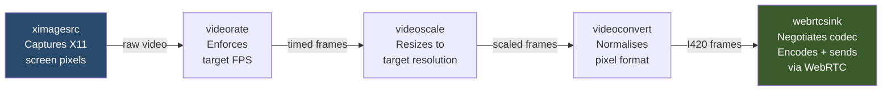
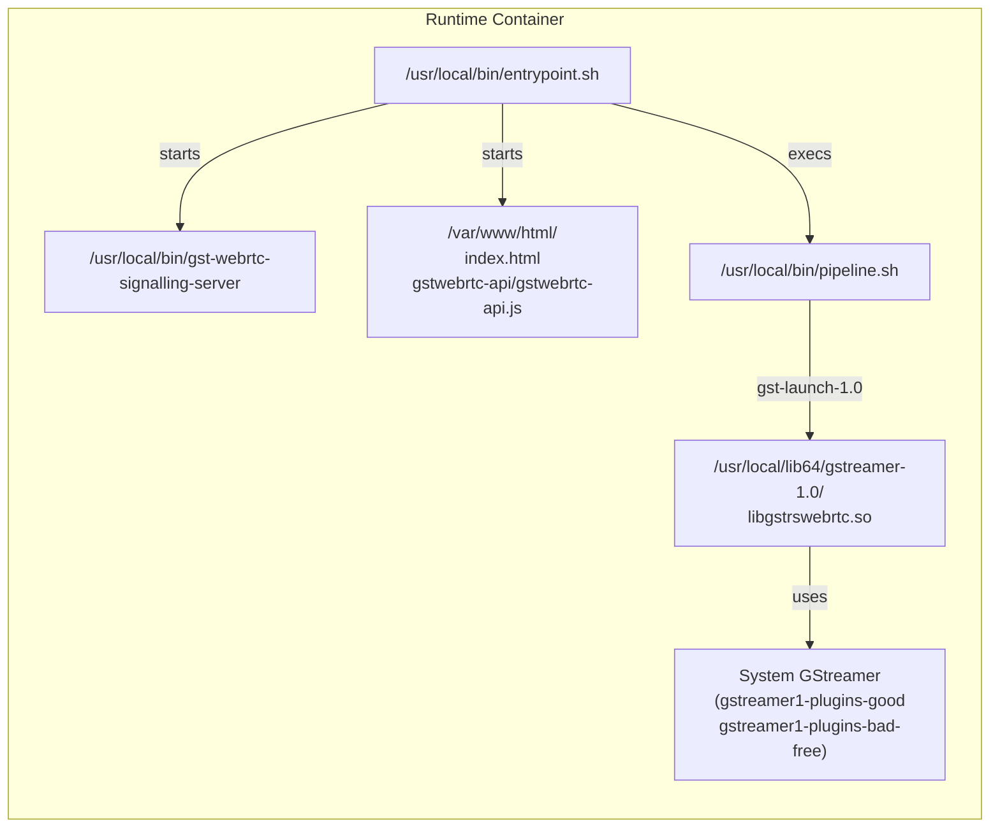
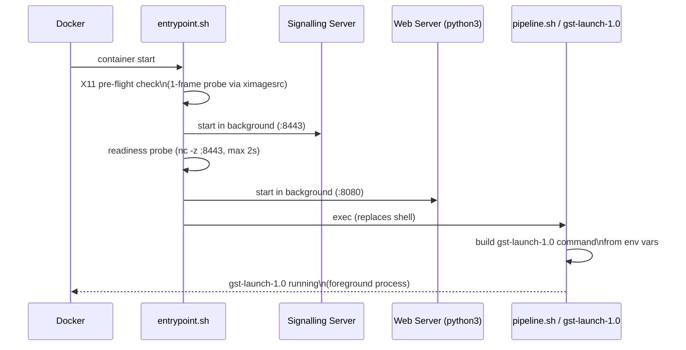
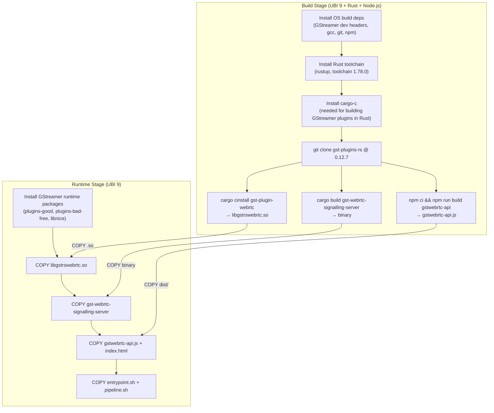
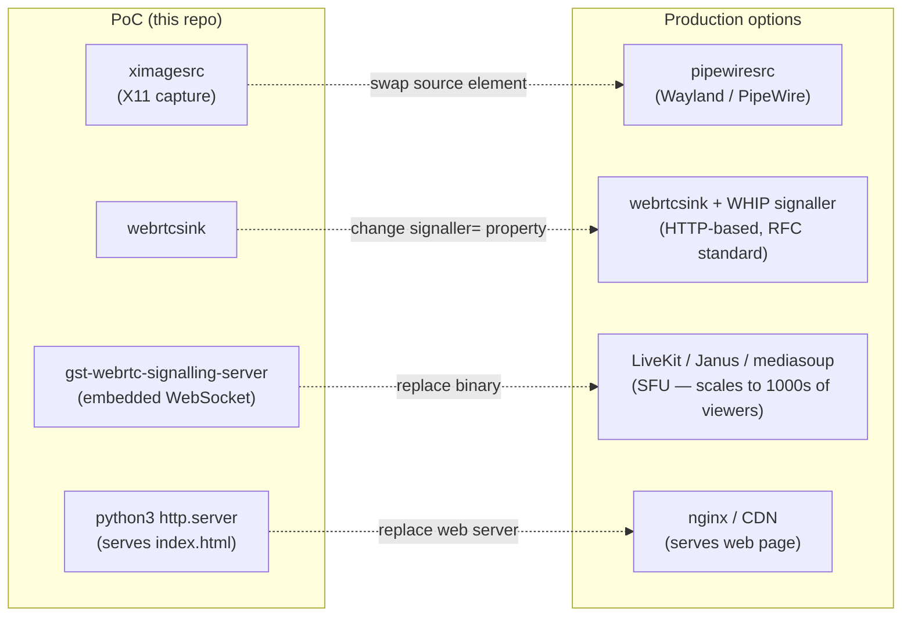

# X11 Desktop Streaming via WebRTC

Streams a Linux desktop (X11) to any modern web browser in real time, with sub-second latency and efficient video compression. Packaged as a single container image based on Red Hat UBI 9.

---

## Table of Contents

1. [How it works — the 30-second version](#how-it-works--the-30-second-version)
2. [Technology primer](#technology-primer)
3. [Architecture](#architecture)
4. [Container internals](#container-internals)
5. [Build process](#build-process)
6. [Running the container](#running-the-container)
7. [Configuration reference](#configuration-reference)
8. [Verifying it works](#verifying-it-works)
9. [Adapting for Wayland](#adapting-for-wayland)
10. [Production upgrade path](#production-upgrade-path)

---

## How it works — the 30-second version

```
Host desktop (X11)
      │  screen pixels
      ▼
 GStreamer pipeline  ──encodes──►  webrtcsink
      │                                 │
      │                        WebRTC signalling
      │                                 │
      ▼                                 ▼
 Container exposes               Browser opens
 two ports:                      http://host:8080
   :8080  web page               and receives live
   :8443  signalling             video stream
```

The desktop screen is captured as a stream of raw video frames, compressed using the VP9 codec, and delivered to the browser over WebRTC — the same protocol used by Google Meet and Zoom. The browser needs no plugin; WebRTC is built into every modern browser.

---

## Technology primer

### GStreamer

GStreamer is a pipeline-based multimedia framework. You assemble a chain of *elements* — each one does one job — and GStreamer moves data between them:

```
[capture] → [resize] → [encode] → [send]
```

Elements are linked with `!` on the command line. For example:

```
ximagesrc ! videoscale ! vp9enc ! ...
```

### WebRTC

WebRTC (Web Real-Time Communication) is an open standard built into all modern browsers that enables peer-to-peer audio/video streaming. Key properties:

- **Low latency** — typically under 500 ms end-to-end
- **Adaptive bitrate** — automatically adjusts quality to available bandwidth
- **Encrypted** — all media is encrypted in transit (DTLS-SRTP)
- **No plugin required** — supported natively in Chrome, Firefox, Safari, Edge

WebRTC requires a **signalling server** to help the two peers (our GStreamer pipeline and the browser) find each other and agree on connection parameters. Once connected, media flows directly between them.

### webrtcsink

`webrtcsink` is a GStreamer *sink element* (a pipeline endpoint) from the [gst-plugins-rs](https://gitlab.freedesktop.org/gstreamer/gst-plugins-rs) project — a collection of GStreamer plugins written in Rust. It handles the entire WebRTC stack:

- Codec negotiation with the browser (decides on VP9, VP8, or H.264)
- Encoding the video
- Setting up the encrypted WebRTC connection
- Sending the compressed video to one or more browser peers simultaneously

From a pipeline perspective, `webrtcsink` is just another element you connect to — but internally it manages all the WebRTC complexity.

### gst-plugins-rs

The official GStreamer project ships additional plugins written in Rust, collected in the `gst-plugins-rs` repository. These are not yet packaged in most Linux distributions, so this project compiles them from source during the Docker build.

### Signalling server

Before two WebRTC peers can exchange video, they need to exchange a small amount of metadata:

- **SDP** (Session Description Protocol) — describes what codecs and formats each side supports
- **ICE candidates** — lists of network addresses through which each peer can be reached

The signalling server (`gst-webrtc-signalling-server`) is a lightweight WebSocket server that acts as a message broker for this exchange. It does **not** carry video — only the setup handshake. Once the peers are connected, the server plays no further role.

### UBI 9 (Universal Base Image)

Red Hat's UBI 9 is a freely redistributable container base image derived from Red Hat Enterprise Linux 9. It provides a stable, enterprise-grade foundation with a consistent package set and long-term security support — suitable for production deployments.

---

## Architecture

### System overview


### Media flow (frame-by-frame)

```mermaid
sequenceDiagram
    participant X11 as X11 Display
    participant GST as GStreamer Pipeline
    participant SIG as Signalling Server
    participant BR as Browser

    BR->>SIG: Connect (WebSocket)
    SIG-->>BR: Assign peer ID

    Note over GST,SIG: webrtcsink detects new peer
    GST->>SIG: SDP Offer (codec list)
    SIG->>BR: Forward SDP Offer
    BR->>SIG: SDP Answer (chosen codec: VP9)
    SIG->>GST: Forward SDP Answer

    GST->>SIG: ICE candidates (network addresses)
    SIG->>BR: Forward ICE candidates
    BR->>SIG: ICE candidates
    SIG->>GST: Forward ICE candidates

    Note over GST,BR: WebRTC connection established (DTLS handshake)

    loop Every frame (~33 ms at 30 fps)
        X11->>GST: Raw pixels (via /tmp/.X11-unix)
        GST->>GST: Scale to target resolution
        GST->>GST: Encode with VP9
        GST->>BR: Compressed frame (SRTP over UDP)
        BR->>BR: Decode + display in &lt;video&gt;
    end
```

### GStreamer pipeline



---

## Container internals



### Startup sequence



---

## Build process

The Docker build uses two stages to keep the final image small. The build stage (~5 GB, discarded after build) compiles everything from source. The runtime stage (~400 MB) contains only what is needed to run.



**Why compile from source?** The `webrtcsink` plugin from `gst-plugins-rs` is not yet packaged in UBI 9's repositories. The Rust ecosystem makes it straightforward to build: `cargo cinstall` compiles the Rust source and installs the resulting `.so` file directly into the GStreamer plugin search path.

**Why pin to version 0.12.7?** The Rust GStreamer bindings (`gstreamer-rs`) must match the C GStreamer version installed on the system. UBI 9 ships GStreamer 1.22.x via its AppStream repository. `gst-plugins-rs` version 0.12.7 targets `gstreamer-rs 0.22`, which requires GStreamer ≥ 1.22 — a precise match.

---

## Running the container

### Prerequisites

- Docker on a Linux host with an active X11 display
- The host display must accept connections from the container

```bash
# Allow the container to connect to the host X display
xhost +local:docker
```

### Build

```bash
docker build -t x11-webrtc-streamer .
```

The first build takes 20–40 minutes (Rust compilation). Subsequent builds use Docker layer cache and complete in seconds unless source dependencies change.

### Run

```bash
docker run --rm \
  --network=host \
  -e DISPLAY=:0 \
  -v /tmp/.X11-unix:/tmp/.X11-unix:ro \
  x11-webrtc-streamer
```

Then open **http://localhost:8080** in a browser.

> **Why `--network=host`?**
> WebRTC uses UDP for media. When the browser and container are on the same machine, `--network=host` lets both sides discover the same host network interfaces during ICE negotiation, so they connect directly without needing a STUN relay server. Without `--network=host`, you must supply a STUN server (see `GST_WEBRTC_STUN_SERVER` below).

### Using Xauthority (alternative to xhost)

If you prefer not to use `xhost`, mount the X authority file instead:

```bash
docker run --rm \
  --network=host \
  -e DISPLAY=:0 \
  -e XAUTHORITY=/root/.Xauthority \
  -v /tmp/.X11-unix:/tmp/.X11-unix:ro \
  -v "$HOME/.Xauthority:/root/.Xauthority:ro" \
  x11-webrtc-streamer
```

---

## Configuration reference

All settings are environment variables passed to `docker run -e`:

| Variable | Default | Description |
|---|---|---|
| `DISPLAY` | `:0` | X11 display to capture |
| `STREAM_CODEC` | `vp9` | Video codec: `vp9`, `vp8`, or `h264`\* |
| `STREAM_WIDTH` | `1920` | Capture width in pixels |
| `STREAM_HEIGHT` | `1080` | Capture height in pixels |
| `STREAM_FRAMERATE` | `30` | Frames per second |
| `STREAM_BITRATE_KBPS` | `2000` | Target encode bitrate (kilobits/s) |
| `SIGNALLING_HOST` | `0.0.0.0` | Network interface for the signalling server |
| `SIGNALLING_PORT` | `8443` | Port for the WebSocket signalling server |
| `WEB_PORT` | `8080` | Port for the HTTP page server |
| `GST_WEBRTC_STUN_SERVER` | _(empty)_ | STUN server URI, e.g. `stun://stun.l.google.com:19302` |

\* H.264 requires adding EPEL and `gstreamer1-plugins-ugly` to the runtime stage of the Dockerfile.

### Example: lower-bandwidth 720p stream

```bash
docker run --rm --network=host \
  -e DISPLAY=:0 \
  -v /tmp/.X11-unix:/tmp/.X11-unix:ro \
  -e STREAM_WIDTH=1280 \
  -e STREAM_HEIGHT=720 \
  -e STREAM_BITRATE_KBPS=1000 \
  x11-webrtc-streamer
```

### Example: access the stream from another machine

When the browser is not on the same host as the container, remove `--network=host` and provide a STUN server so both sides can discover each other's public IP:

```bash
docker run --rm \
  -p 8080:8080 \
  -p 8443:8443 \
  -e DISPLAY=:0 \
  -v /tmp/.X11-unix:/tmp/.X11-unix:ro \
  -e GST_WEBRTC_STUN_SERVER=stun://stun.l.google.com:19302 \
  x11-webrtc-streamer
```

Then open `http://<server-ip>:8080?stun=stun.l.google.com:19302` in the browser (the `?stun=` parameter tells the browser's WebRTC stack to use the same STUN server).

---

## Verifying it works

**1 — Check the plugin loaded correctly:**

```bash
docker run --rm x11-webrtc-streamer gst-inspect-1.0 webrtcsink
```

Expected: a long property list including `video-caps`, `signaller`, `target-bitrate`.

**2 — Smoke test without X11 (synthetic video):**

```bash
docker run --rm --network=host x11-webrtc-streamer \
  gst-launch-1.0 videotestsrc pattern=ball \
  ! webrtcsink run-signalling-server=true run-web-server=true
```

Open `https://localhost:9090` (accept the self-signed certificate warning). A bouncing ball should appear.

**3 — Full X11 stream:**

```bash
xhost +local:docker
docker run --rm --network=host \
  -e DISPLAY=:0 \
  -v /tmp/.X11-unix:/tmp/.X11-unix:ro \
  x11-webrtc-streamer
# Open http://localhost:8080
```

**4 — Performance check:**

```bash
docker stats <container-name>
```

VP9 software encoding at 1080p30 typically uses 100–200% CPU (1–2 cores) on modern hardware. If CPU is a concern, reduce resolution or switch to VP8 (`STREAM_CODEC=vp8`), which is cheaper to encode.

---

## Adapting for Wayland

The design deliberately isolates the capture source from the rest of the stack. Migrating from X11 to Wayland requires changing **one line** in `pipeline.sh`:

```bash
# X11 (current)
ximagesrc display-name="${DISPLAY}" use-damage=false \

# Wayland — replace with PipeWire source
pipewiresrc path="${PIPEWIRE_NODE_ID:-0}" do-timestamp=true \
```

PipeWire is the modern audio/video routing layer on Linux that works natively with Wayland compositors (GNOME, KDE Plasma, sway). On Wayland, screen capture goes through the `xdg-desktop-portal` → PipeWire → `pipewiresrc` path.

Everything downstream — `videorate`, `videoscale`, `webrtcsink`, the signalling server, and the web page — is unchanged.

---

## Production upgrade path

The PoC uses simple in-process components for convenience. Each can be swapped independently for production:



### Signalling server (Day 2)

Deploy `gst-webrtc-signalling-server` as its own container. Set `SIGNALLING_PORT` in the streaming container to point at it. No other changes needed.

### WHIP (standard WebRTC ingest)

[WHIP](https://www.ietf.org/archive/id/draft-ietf-wish-whip-01.txt) is an HTTP-based WebRTC ingest standard supported by Cloudflare Stream, Janus, LiveKit, and others. Switch `webrtcsink` to use it by changing a single property — no pipeline restructuring:

```bash
# In pipeline.sh, replace the signaller properties with:
webrtcsink signaller::uri="https://your-sfu.example.com/whip/ingest" \
           signaller=whipsink
```

### Scaling to many viewers

`webrtcsink` manages multiple browser peers natively. For very large deployments (hundreds of simultaneous viewers), introduce a Selective Forwarding Unit (SFU) such as LiveKit or Janus between `webrtcsink` and the browsers. The SFU receives one stream from the container and fans it out to viewers, reducing upstream bandwidth from the capture host.

### H.264 (wider hardware support)

VP9 is used by default because it requires no additional packages. To enable H.264 (better hardware encoder support on GPU-equipped hosts):

1. Add EPEL to both build and runtime stages of the Dockerfile
2. Install `gstreamer1-plugins-ugly` in the runtime stage
3. Set `STREAM_CODEC=h264` at runtime
4. For hardware encoding (VAAPI), pass `--device /dev/dri` to `docker run`
