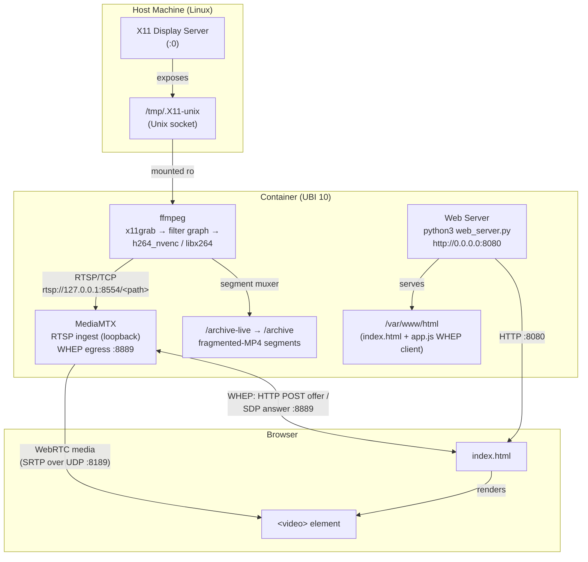

# X11 Desktop Streaming via WebRTC

Streams a Linux desktop (X11) to any modern browser with sub-second latency
while continuously recording it to disk. One container image (Red Hat
UBI 10), no source builds: **ffmpeg** (capture + encode) → **MediaMTX**
(WebRTC/WHEP egress) → browser.

> Migrating from the GStreamer/webrtcsink version? See
> [Migration from the GStreamer stack](#migration-from-the-gstreamer-stack).
> Internals (filter graph, encoders, archive lifecycle, HTTP API) are in
> [PIPELINE.md](PIPELINE.md).

---

## How it works

```
Host desktop (X11)
      │  screen pixels
      ▼
   ffmpeg  ── one x11grab capture, fan-out to N H.264 encodes ──┐
      │                                                          │
      │ RTSP (localhost only)                                    │ fragmented-MP4
      ▼                                                          ▼ segments
   MediaMTX                                                 /archive-live
      │                                                          │ rotate + rename
      │ WebRTC (WHEP)                                            ▼
      ▼                                                      /archive
   Browser opens http://host:8080 and receives live video
```

One ffmpeg process does all media work: `x11grab` captures the display, a
filter graph crops per-monitor regions and scales each resolution tier, and
`h264_nvenc` (GPU) or `libx264` (CPU) encodes every output — live tiers to
RTSP on loopback, the archive to disk. [MediaMTX](https://github.com/bluenviron/mediamtx)
(a single static Go binary) re-serves each RTSP path to browsers as WebRTC.
The browser page POSTs an SDP offer to an HTTP endpoint (**WHEP**), gets
the answer back, and media flows over a plain `RTCPeerConnection` — no
signalling WebSocket, no client library; the whole client is
`service/web/app.js`, served same-origin with no build step.

Two consequences worth knowing:

- **MediaMTX is a passthrough** — it never transcodes and cannot ask ffmpeg
  for a keyframe, so a joining viewer waits for the next keyframe. The
  encoders run a 1-second keyframe interval (`LIVE_GOP`); that interval is
  the worst-case join delay.
- **Every tier is an always-on encode.** Unlike webrtcsink's per-viewer
  encoders, an unwatched tier still costs an encoder session — keep the
  ladder short (`LIVE_SCALE_LADDER`, default `1.0,0.5`).

## Architecture


```mermaid
graph TD
    subgraph host["Host Machine (Linux)"]
        X11["X11 Display Server\n(:0)"]
        sock["/tmp/.X11-unix\n(Unix socket)"]
        X11 -->|"exposes"| sock
    end

    subgraph container["Container (UBI 10)"]
        direction TB
        ff["ffmpeg\nx11grab → filter graph →\nh264_nvenc / libx264"]
        mtx["MediaMTX\nRTSP ingest (loopback)\nWHEP egress :8889"]
        web["Web Server\npython3 web_server.py\nhttp://0.0.0.0:8080"]
        arch["/archive-live → /archive\nfragmented-MP4 segments"]

        ff -->|"RTSP/TCP\nrtsp://127.0.0.1:8554/&lt;path&gt;"| mtx
        ff -->|"segment muxer"| arch
        web -->|"serves"| html["/var/www/html\n(index.html + app.js WHEP client)"]
    end

    subgraph browser["Browser"]
        page["index.html"]
        video["&lt;video&gt; element"]
        page -->|"renders"| video
    end

    sock -->|"mounted ro"| ff
    web -->|"HTTP :8080"| page
    mtx <-->|"WHEP: HTTP POST offer /\nSDP answer :8889"| page
    mtx -->|"WebRTC media\n(SRTP over UDP :8189)"| video
```

Every deployment serves one **full-frame** stream plus one stream per
detected monitor (or per `DESKTOP_SPLITS` region), each at a ladder of
resolutions. Each (stream, tier) pair is one MediaMTX path:

| Page | Tier paths (default ladder) |
|---|---|
| `/` (full frame) | `full_t0`, `full_t1` |
| `/left` (or `/top`, `/screen1`, …) | `left_t0`, `left_t1` |

The browser reads `/config.json`, picks the smallest tier that still covers
its rendered video size, and connects to that tier's WHEP endpoint
(`http://host:8889/<path>/whep`). Resizing across a tier boundary
reconnects (~250 ms blip).

### Startup sequence (entrypoint.sh)

1. **Pre-flight** — log GPU presence, verify the X display with a one-frame
   ffmpeg grab.
2. **`desktop_config.py`** — probe RandR, compute the tier ladder, write
   `/run/desktop-stream/config.json` (shared by all processes).
3. **MediaMTX** — `stream_command.py` renders `mediamtx.yml` (loopback RTSP
   ingest, WHEP only, only the configured paths); readiness-probed.
4. **`web_server.py`** — serves the page, `/config.json`, `/archive`, `/video`.
5. **`pipeline.py`** — probes `h264_nvenc` once, builds the single ffmpeg
   command, and supervises it: restarts with backoff if it dies (viewers
   see a short freeze, not a page error), tails the segment list, and
   publishes completed archive segments under timestamped names.

## Build

Single-stage build, no compilation (~600 MB, a few minutes):

```bash
make service hub     # or: podman build -t desktop-stream-service:ci service/
```

| Component | Source | Air-gap story |
|---|---|---|
| ffmpeg (full: NVENC, libx264, libopus, x11grab) | RPM Fusion Free (EL10) | mirror the repo |
| Python 3, pip, python-xlib | UBI/Rocky/EPEL + PyPI | mirror the repos |
| MediaMTX | GitHub release binary, **pinned version + sha256** | vendor the tarball, pass `--build-arg MEDIAMTX_URL=…` |
| Web page + WHEP client | `service/web/` | in-repo, no build step |

Watch out for:

- **EPEL's `ffmpeg-free`** conflicts with RPM Fusion's `ffmpeg-libs` and
  lacks NVENC — the Containerfile asserts `h264_nvenc` and `x11grab` at
  build time.
- **MediaMTX can't be built with `go install`** (its `go generate` fetches
  assets); vendoring the checksum-verified release binary is the supported
  path.

## Running

Prerequisites: Docker/Podman on a Linux host with an active X11 display
that accepts the container's connections (`xhost +local:docker`, or mount
an Xauthority file and set `-e XAUTHORITY`).

```bash
docker run --rm \
  --network=host \
  -e DISPLAY=:0 \
  -v /tmp/.X11-unix:/tmp/.X11-unix:ro \
  -v /srv/archive:/archive \
  desktop-stream-service:ci
# open http://localhost:8080
```

> **Why `--network=host`?** WebRTC media flows over UDP; with host
> networking MediaMTX advertises the host's real addresses as ICE
> candidates. Without it, publish `-p 8080:8080 -p 8889:8889 -p 8189:8189/udp`
> and set `-e WEBRTC_ADDITIONAL_HOSTS=<host-ip>` so viewers get a
> reachable address.

### NVIDIA GPU encoding

Add `--gpus all` (with
[nvidia-container-toolkit](https://docs.nvidia.com/datacenter/cloud-native/container-toolkit/latest/install-guide.html)
or Podman CDI) and all encodes run on NVENC. `pipeline.py` probes
`h264_nvenc` at startup and falls back to `libx264` automatically — the log
shows `Pipeline mode: GPU (h264_nvenc)` or `CPU (libx264)`.

- **Session budget:** every (stream, tier) pair plus the archive is one
  concurrent NVENC session. Consumer GeForce GPUs allow 8; the default
  2-tier ladder with two monitors uses 7.
- Capture and scaling stay on the CPU (this ffmpeg build has no CUDA scale
  filters); only encoding is offloaded.

## Configuration reference

All settings are environment variables (`docker run -e`).

### Capture and streams

| Variable | Default | Description |
|---|---|---|
| `DISPLAY` | `:0` | X11 display to capture |
| `DESKTOP_NAME` | `desktop` | Page-header label; also the archive filename prefix |
| `STREAM_WIDTH` / `STREAM_HEIGHT` | _(native)_ | Capture size; unset reads the X server's native size via RandR. When set differently from native, auto-detected monitor regions scale into the frame; explicit `DESKTOP_SPLITS` values are frame coordinates |
| `STREAM_FRAMERATE` | `30` | Frames per second |
| `DESKTOP_SPLITS` | _(auto)_ | Per-screen regions `WxH+X+Y;…`; unset auto-detects monitors via RandR |
| `LIVE_SCALE_LADDER` | `1.0,0.5` | Fractional scales for the tier ladder. **Every tier is an always-on encode per stream** — keep it short. Accepts decimals, ints, ratios (`1/3`); values in (0, 1.0]; `1.0` always included |

### Live encoding

| Variable | Default | Description |
|---|---|---|
| `LIVE_CQ` | `18` | Constant-quality target (H.264 QP scale; 18 ≈ visually lossless) |
| `LIVE_MAXRATE` | `8M` | Hard bitrate cap for the full-res tier — **set to the worst-case provisioned per-viewer bandwidth**. Smaller tiers are capped proportionally to pixel count |
| `LIVE_BUFSIZE` | 2× maxrate | VBV buffer; smaller = smoother bitrate, larger = more motion detail |
| `LIVE_GOP` | = framerate | Keyframe interval in frames — also the worst-case viewer join delay; keep at ~1 s |

There is no congestion-control feedback to the encoder (the old per-viewer
REMB adaptation was a webrtcsink feature): one encode is shared by all
viewers of a tier and holds constant quality under `LIVE_MAXRATE`. Motion
bursts appear as brief clarity dips, never packet loss. See the
rate-control decision record in `service/stream_command.py` for the
fixed-CBR alternative.

### Ports / MediaMTX

| Variable | Default | Description |
|---|---|---|
| `WEB_PORT` | `8080` | HTTP page server |
| `WEB_DIR` | `/var/www/html` | Static file root (set by the image; rarely changed) |
| `WHEP_PORT` | `8889` | MediaMTX WHEP/HTTP port (browser-facing) |
| `WEBRTC_UDP_PORT` | `8189` | MediaMTX ICE/UDP media port (browser-facing) |
| `MEDIAMTX_RTSP_PORT` | `8554` | Loopback-only RTSP ingest (ffmpeg → MediaMTX) |
| `WEBRTC_ADDITIONAL_HOSTS` | _(empty)_ | Extra IPs/hostnames to advertise as ICE candidates (needed off host networking or behind NAT) |

### Archive

| Variable | Default | Description |
|---|---|---|
| `ARCHIVE_DIR` | `/archive` | Completed, timestamp-named segments |
| `ARCHIVE_LIVE_DIR` | `/archive-live` | In-progress segment (readable mid-write — fragmented MP4, moov up front) |
| `ARCHIVE_SEGMENT_SEC` | `600` | Segment duration |
| `ARCHIVE_QUALITY` | `visually-lossless` | `visually-lossless` (constant QP), `lossless` (NVENC lossless tune / x264 QP 0), or `legacy` (fixed-bitrate VBR) |
| `ARCHIVE_QP` | `18` | QP for `visually-lossless` mode |
| `ARCHIVE_BITRATE` | `6000` | kbps, `legacy` mode only |
| `ARCHIVE_MAX_BYTES` / `ARCHIVE_MAX_AGE_DAYS` | `0` | Size/age-based purge; 0 = unlimited |
| `ARCHIVE_MAX_CONCURRENT` | `2` | Max simultaneous `/archive` downloads; beyond it requests get `503` + `Retry-After` (windows over 24 h get `400`) |
| `VIDEO_FILL_COLOR` | `0xFF000000` | `/video` gap-fill color |
| `VIDEO_QP` | = `ARCHIVE_QP` | `/video` output quality; tracks the archive so there's no second knob |
| `VIDEO_MAX_CONCURRENT` | `2` | Max simultaneous `/video` transcodes; beyond it requests get `503` + `Retry-After` so archive downloads can't starve the live encoders |
| `VIDEO_DEFAULT_WIDTH` / `VIDEO_DEFAULT_HEIGHT` | `1920`/`1080` | `/video` output size when no segments exist |

### Page URL parameters

| Parameter | Effect |
|---|---|
| `?tier=N` | Pin tier index N (0 = full resolution); disables auto-switching |
| `?whep=<url>` | Pin a specific WHEP endpoint URL; disables auto-switching |
| `?stun=host:port` | Add a STUN server for ICE |
| `?turn_uri=…&turn_user=…&turn_cred=…` | Add a TURN relay for ICE |

## Verifying it works

```bash
# 1 — encoders present in the image
docker run --rm --entrypoint ffmpeg desktop-stream-service:ci \
  -hide_banner -encoders | grep -E 'h264_nvenc|libx264'

# 2 — run it (see Running above), open http://localhost:8080

# 3 — WHEP endpoint answers
curl -i -X OPTIONS http://localhost:8889/full_t0/whep   # expect 2xx

# 4 — archive is being written (after the first rotation)
ls /srv/archive          # timestamped *_to_*.mp4
```

Automated suites: `make test` (pure-Python unit tests) and
`make functional` (Java, browser-driven container integration) — both run
in CI on every push.

## Migration from the GStreamer stack

The previous version required source builds of gst-plugins-rs (Rust),
usrsctp, and a patched gst-plugins-bad, plus a WebSocket signalling server
per tier. All gone:

| Before | After |
|---|---|
| `base/` builder image (~5 GB, 20–40 min Rust/meson builds) | single-stage `service/Containerfile` |
| Signalling server, one port per (stream × tier), 8443+N | one WHEP port (`8889/tcp`) + one media port (`8189/udp`) |
| gstwebrtc-api npm bundle | same-origin WHEP client in `app.js` |
| VP9, per-viewer encoders, REMB adaptation to 80 Mbps | H.264, one shared encode per tier, constant quality capped at `LIVE_MAXRATE` |
| splitmuxsink archive (moov at EOS; mdat-walker remux to serve the active segment) | ffmpeg segment muxer fMP4 (moov up front; active segment served by plain copy) |
| Lazy per-consumer encoders (idle tiers free) | every tier always encoded → default ladder `1.0,0.5` |

Operational notes: close 8443–8751/tcp, open 8889/tcp + 8189/udp; scripts
reading `/config.json` switch from `signallingPort` fields to `whepPath` +
`webrtcPort`; archive naming, `/archive`, `/video`, and purge behaviour are
unchanged.
