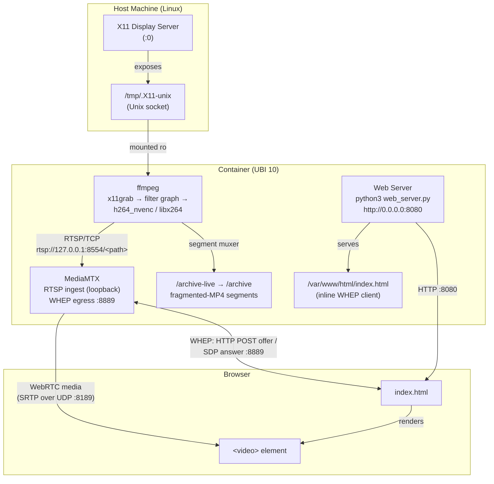
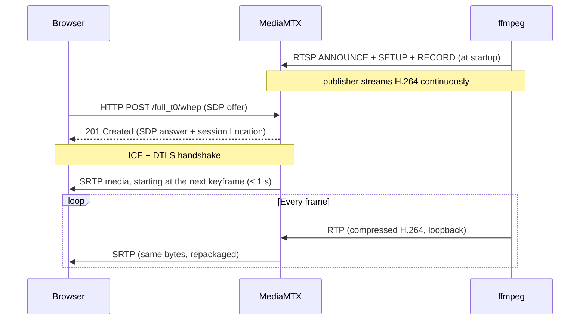
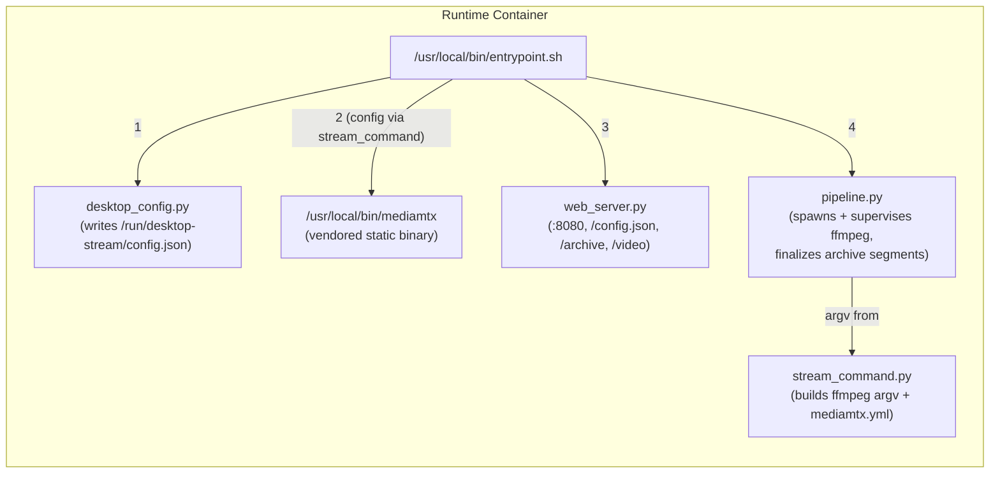

# X11 Desktop Streaming via WebRTC

Streams a Linux desktop (X11) to any modern web browser in real time, with
sub-second latency and efficient video compression, while continuously
recording the desktop to disk. Packaged as a single container image based on
Red Hat UBI 10.

The stack is **ffmpeg** (capture + encode) → **MediaMTX** (WebRTC/WHEP
egress) → browser. There are **no source builds** — every component comes
from a mirror-able RPM repository or a single vendored static binary.

> Migrating from the GStreamer/webrtcsink version? See
> [Migration from the GStreamer stack](#migration-from-the-gstreamer-stack).

---

## Table of Contents

1. [How it works — the 30-second version](#how-it-works--the-30-second-version)
2. [Technology primer](#technology-primer)
3. [Architecture](#architecture)
4. [Container internals](#container-internals)
5. [Build process](#build-process)
6. [Running the container](#running-the-container)
7. [NVIDIA GPU encoding](#nvidia-gpu-encoding)
8. [Configuration reference](#configuration-reference)
9. [Verifying it works](#verifying-it-works)
10. [Migration from the GStreamer stack](#migration-from-the-gstreamer-stack)

---

## How it works — the 30-second version

```
Host desktop (X11)
      │  screen pixels
      ▼
   ffmpeg  ── one x11grab capture, fan-out to N H.264 encodes ──┐
      │                                                          │
      │ RTSP (localhost only)                                    │ fragmented-MP4
      ▼                                                          ▼ segments
   MediaMTX                                                 /archive-live
      │                                                          │ rotate + rename
      │ WebRTC (WHEP)                                            ▼
      ▼                                                      /archive
   Browser opens http://host:8080 and receives live video
```

The desktop screen is captured as a stream of raw video frames, compressed
with H.264 (NVENC on the GPU when available, x264 otherwise), and delivered
to the browser over WebRTC — the same protocol used by Google Meet and Zoom.
The browser needs no plugin. In parallel, the same capture is encoded once
more at archival quality and written to disk as rotating MP4 segments.

---

## Technology primer

### ffmpeg

ffmpeg is the swiss-army knife of video processing. One ffmpeg process does
everything on the capture side:

- **`x11grab`** reads raw frames from the X11 display.
- A **filter graph** (`-filter_complex`) crops per-monitor regions and
  scales each resolution tier — one capture feeds every output.
- **`h264_nvenc`** (GPU) or **`libx264`** (CPU) encodes each output.
- The **RTSP muxer** publishes each live tier to MediaMTX over loopback;
  the **segment muxer** writes the archive to disk.

### WebRTC and WHEP

WebRTC is the browser-native standard for real-time media: low latency
(typically under 500 ms), encrypted (DTLS-SRTP), no plugin required.

**WHEP** (WebRTC-HTTP Egress Protocol) is the standard way for a browser to
*receive* a WebRTC stream from a server: the page POSTs an SDP offer to an
HTTP endpoint, gets the answer back in the response, and media flows over a
normal `RTCPeerConnection`. No signalling WebSocket, no client library —
the whole client is ~100 lines inlined in `index.html`.

### MediaMTX

[MediaMTX](https://github.com/bluenviron/mediamtx) is a zero-dependency
media server distributed as one static Go binary. It ingests the RTSP
streams ffmpeg publishes on loopback and re-serves each one to browsers via
WHEP, handling all WebRTC negotiation (ICE/DTLS/SRTP). It never touches the
GPU and never transcodes — it repackages compressed frames, so its CPU cost
is trivial.

One consequence worth knowing: MediaMTX is a *passthrough*. It cannot ask
ffmpeg for a keyframe, so a viewer joining mid-stream sees the first frame
only when the next keyframe arrives. The encoders therefore run a 1-second
keyframe interval (`LIVE_GOP`) — worst-case join delay is one second.

### UBI 10 (Universal Base Image)

Red Hat's UBI 10 is a freely redistributable container base image derived
from RHEL 10. Package repositories used: Rocky Linux 10 (BaseOS/AppStream/
CRB), EPEL 10, and **RPM Fusion Free** — which ships the full ffmpeg build
(NVENC, libx264, libopus, x11grab). All are mirror-able for air-gapped
deployments.

---

## Architecture

### System overview


```mermaid
graph TD
    subgraph host["Host Machine (Linux)"]
        X11["X11 Display Server\n(:0)"]
        sock["/tmp/.X11-unix\n(Unix socket)"]
        X11 -->|"exposes"| sock
    end

    subgraph container["Container (UBI 10)"]
        direction TB
        ff["ffmpeg\nx11grab → filter graph →\nh264_nvenc / libx264"]
        mtx["MediaMTX\nRTSP ingest (loopback)\nWHEP egress :8889"]
        web["Web Server\npython3 web_server.py\nhttp://0.0.0.0:8080"]
        arch["/archive-live → /archive\nfragmented-MP4 segments"]

        ff -->|"RTSP/TCP\nrtsp://127.0.0.1:8554/&lt;path&gt;"| mtx
        ff -->|"segment muxer"| arch
        web -->|"serves"| html["/var/www/html/index.html\n(inline WHEP client)"]
    end

    subgraph browser["Browser"]
        page["index.html"]
        video["&lt;video&gt; element"]
        page -->|"renders"| video
    end

    sock -->|"mounted ro"| ff
    web -->|"HTTP :8080"| page
    mtx <-->|"WHEP: HTTP POST offer /\nSDP answer :8889"| page
    mtx -->|"WebRTC media\n(SRTP over UDP :8189)"| video
```

### Streams and tiers

Every deployment serves one **full-frame** stream plus one stream per
detected monitor (or per `DESKTOP_SPLITS` region). Each stream is encoded at
a ladder of resolutions (default: 1.0 and 0.5 scale). Each (stream, tier)
pair is one MediaMTX path:

| Page | Tier paths (default ladder) |
|---|---|
| `/` (full frame) | `full_t0`, `full_t1` |
| `/left` (or `/top`, `/screen1`, …) | `left_t0`, `left_t1` |

The browser reads `/config.json`, picks the smallest tier whose pixel
dimensions still cover its rendered video size, and connects to that tier's
WHEP endpoint (`http://host:8889/<path>/whep`). Resizing across a tier
boundary reconnects to the new tier (~250 ms blip).

Unlike the previous webrtcsink design, **every tier is encoded
continuously** — an unwatched tier still costs an encoder session. Keep the
ladder short (see `WEBRTC_SCALE_LADDER`).

### Media flow (viewer join)


```mermaid
sequenceDiagram
    participant BR as Browser
    participant MTX as MediaMTX
    participant FF as ffmpeg

    FF->>MTX: RTSP ANNOUNCE + SETUP + RECORD (at startup)
    Note over FF,MTX: publisher streams H.264 continuously

    BR->>MTX: HTTP POST /full_t0/whep (SDP offer)
    MTX-->>BR: 201 Created (SDP answer + session Location)
    Note over BR,MTX: ICE + DTLS handshake
    MTX->>BR: SRTP media, starting at the next keyframe (≤ 1 s)
    loop Every frame
        FF->>MTX: RTP (compressed H.264, loopback)
        MTX->>BR: SRTP (same bytes, repackaged)
    end
```

---

## Container internals


```mermaid
graph TD
    subgraph runtime["Runtime Container"]
        direction TB
        ep["/usr/local/bin/entrypoint.sh"]
        dc["desktop_config.py\n(writes /run/desktop-stream/config.json)"]
        sc["stream_command.py\n(builds ffmpeg argv + mediamtx.yml)"]
        pl["pipeline.py\n(spawns + supervises ffmpeg,\nfinalizes archive segments)"]
        mtx["/usr/local/bin/mediamtx\n(vendored static binary)"]
        ws["web_server.py\n(:8080, /config.json, /archive, /video)"]

        ep -->|"1"| dc
        ep -->|"2 (config via stream_command)"| mtx
        ep -->|"3"| ws
        ep -->|"4"| pl
        pl -->|"argv from"| sc
    end
```

### Startup sequence

1. **Pre-flight** — log GPU presence (`nvidia-smi`), verify the X display
   is reachable with a one-frame ffmpeg grab.
2. **`desktop_config.py`** — probe RandR for resolution/monitors, compute
   the tier ladder, write `/run/desktop-stream/config.json`.
3. **MediaMTX** — `stream_command.py` renders `mediamtx.yml` (loopback RTSP
   ingest, WHEP on `WEBRTC_PORT`, everything else disabled, only the
   configured paths allowed); readiness-probed before continuing.
4. **`web_server.py`** — serves the page, `/config.json`, and the archive
   endpoints.
5. **`pipeline.py`** — probes `h264_nvenc` with a one-frame test encode,
   builds the single ffmpeg command, and supervises it: if ffmpeg dies it
   is restarted with backoff (MediaMTX tolerates the publisher dropping and
   re-appearing; viewers see a short freeze, not a page error). The same
   loop tails ffmpeg's segment list and publishes completed archive
   segments under timestamped names.

---

## Build process

Single-stage build, no compilation. The final image is ~600 MB and builds
in a few minutes (package installs + one download).

| Component | Source | Air-gap story |
|---|---|---|
| ffmpeg (full: NVENC, libx264, libopus, x11grab) | RPM Fusion Free (EL10) | mirror the repo |
| Python 3, pip, python-xlib | UBI/Rocky/EPEL + PyPI | mirror the repos |
| MediaMTX | GitHub release binary, **pinned version + sha256** | vendor one tarball into the internal artifact store, pass `--build-arg MEDIAMTX_URL=…` |
| Web page + WHEP client | inline in `service/web/index.html` | in-repo, no build step |

Two things to watch:

- **Do not install EPEL's `ffmpeg-free`** — it conflicts with RPM Fusion's
  `ffmpeg-libs` and lacks NVENC. The Containerfile asserts `h264_nvenc` and
  `x11grab` are present at build time.
- **MediaMTX cannot be built with `go install`** — its build requires
  `go generate`, which downloads assets from GitHub. Vendoring the release
  binary is the supported path (checksum-verified via `MEDIAMTX_SHA256`).

```bash
# Build (service and hub are independent)
make service hub
# or directly:
podman build -t desktop-stream-service:ci service/
```

---

## Running the container

### Prerequisites

- Docker/Podman on a Linux host with an active X11 display
- The host display must accept connections from the container

```bash
xhost +local:docker
```

### Run

```bash
docker run --rm \
  --network=host \
  -e DISPLAY=:0 \
  -v /tmp/.X11-unix:/tmp/.X11-unix:ro \
  -v /srv/archive:/archive \
  desktop-stream-service:ci
```

Then open **http://localhost:8080** in a browser.

> **Why `--network=host`?**
> WebRTC media flows over UDP. With host networking, MediaMTX advertises
> the host's real interface addresses as ICE candidates and browsers
> connect directly. Without it, publish `-p 8080:8080 -p 8889:8889
> -p 8189:8189/udp` and set `-e WEBRTC_ADDITIONAL_HOSTS=<host-ip>` so
> MediaMTX advertises an address viewers can actually reach.

### Using Xauthority (alternative to xhost)

```bash
docker run --rm \
  --network=host \
  -e DISPLAY=:0 \
  -e XAUTHORITY=/root/.Xauthority \
  -v /tmp/.X11-unix:/tmp/.X11-unix:ro \
  -v "$HOME/.Xauthority:/root/.Xauthority:ro" \
  desktop-stream-service:ci
```

---

## NVIDIA GPU encoding

With an NVIDIA GPU and
[nvidia-container-toolkit](https://docs.nvidia.com/datacenter/cloud-native/container-toolkit/latest/install-guide.html)
(or Podman CDI injection), all encodes run on the GPU's NVENC hardware:

```bash
docker run --rm --gpus all \
  --network=host \
  -e DISPLAY=:0 \
  -v /tmp/.X11-unix:/tmp/.X11-unix:ro \
  desktop-stream-service:ci
```

- `pipeline.py` probes `h264_nvenc` once at startup with a one-frame test
  encode; if the driver libraries aren't injected it falls back to
  `libx264` automatically. The startup log shows which path was chosen
  (`Pipeline mode: GPU (h264_nvenc)` / `CPU (libx264)`).
- **Session budget**: every (stream, tier) pair plus the archive is one
  concurrent NVENC session. Consumer GeForce GPUs allow 8 concurrent
  sessions; datacenter GPUs are unrestricted. The default 2-tier ladder
  with two monitors uses 7 sessions.
- Capture and scaling run on the CPU (the RPM Fusion ffmpeg build has no
  CUDA scale filters); only encoding is offloaded.

Verify: `nvidia-smi dmon -s u -d 1` on the host while streaming, or check
the startup log.

---

## Configuration reference

All settings are environment variables passed to `docker run -e`.

### Capture and streams

| Variable | Default | Description |
|---|---|---|
| `DISPLAY` | `:0` | X11 display to capture |
| `DESKTOP_NAME` | `desktop` | Page-header label; also the archive filename prefix |
| `STREAM_WIDTH` / `STREAM_HEIGHT` | _(native)_ | Capture size; unset reads the X server's native size via RandR |
| `STREAM_FRAMERATE` | `30` | Frames per second |
| `DESKTOP_SPLITS` | _(auto)_ | Per-screen regions `WxH+X+Y;…`; unset auto-detects monitors via RandR |
| `WEBRTC_SCALE_LADDER` | `1.0,0.5` | Fractional scales for the per-stream tier ladder. **Every tier is an always-on encode per stream** — keep it short. Accepts decimals, ints, ratios (`1/3`); values in (0, 1.0]; `1.0` always included |

### Live encoding

| Variable | Default | Description |
|---|---|---|
| `LIVE_CQ` | `18` | Constant-quality target (H.264 QP scale; 18 ≈ visually lossless) |
| `LIVE_MAXRATE` | `8M` | Hard bitrate cap for the full-res tier — **set this to the worst-case provisioned per-viewer bandwidth**. Smaller tiers are capped proportionally to pixel count |
| `LIVE_BUFSIZE` | 2× maxrate | VBV buffer; smaller = smoother bitrate, larger = more motion detail |
| `LIVE_GOP` | = framerate | Keyframe interval in frames. This is also the worst-case viewer join delay (MediaMTX cannot request keyframes from the publisher) — keep it at ~1 s |

There is no congestion-control feedback loop to the encoder (the old
per-viewer REMB adaptation was a webrtcsink feature): the encode is shared
by all viewers of a tier and holds constant quality under the `LIVE_MAXRATE`
cap. On a provisioned network, cap at the provisioned rate and motion
bursts appear as brief clarity dips instead of packet loss. See the
rate-control decision record in `service/stream_command.py` (including the
fixed-CBR alternative and when to prefer it).

### Ports / MediaMTX

| Variable | Default | Description |
|---|---|---|
| `WEB_PORT` | `8080` | HTTP page server |
| `WEB_DIR` | `/var/www/html` | Static file root for the page server (set by the image; rarely changed) |
| `WEBRTC_PORT` | `8889` | MediaMTX WHEP/HTTP port (browser-facing) |
| `WEBRTC_UDP_PORT` | `8189` | MediaMTX ICE/UDP media port (browser-facing) |
| `MEDIAMTX_RTSP_PORT` | `8554` | Loopback-only RTSP ingest (ffmpeg → MediaMTX) |
| `WEBRTC_ADDITIONAL_HOSTS` | _(empty)_ | Comma-separated extra IPs/hostnames to advertise as ICE candidates (needed when not on host networking, or behind NAT) |

### Archive

| Variable | Default | Description |
|---|---|---|
| `ARCHIVE_DIR` | `/archive` | Completed, timestamp-named segments |
| `ARCHIVE_LIVE_DIR` | `/archive-live` | In-progress segment (readable mid-write — fragmented MP4 with moov up front) |
| `ARCHIVE_SEGMENT_SEC` | `600` | Segment duration |
| `ARCHIVE_QUALITY` | `visually-lossless` | `visually-lossless` (constant QP), `lossless` (NVENC lossless tune / x264 QP 0), or `legacy` (fixed-bitrate VBR) |
| `ARCHIVE_QP` | `18` | QP for `visually-lossless` mode |
| `ARCHIVE_BITRATE` | `6000` | kbps, `legacy` mode only |
| `ARCHIVE_MAX_BYTES` / `ARCHIVE_MAX_AGE_DAYS` | `0` | Size/age-based purge; 0 = unlimited |
| `VIDEO_FILL_COLOR` | `0xFF000000` | `/video` gap-fill color |
| `VIDEO_QP` | = `ARCHIVE_QP` | `/video` output encode quality (QP); tracks the archive quality so there is no second knob to tune |
| `VIDEO_DEFAULT_WIDTH` / `VIDEO_DEFAULT_HEIGHT` | `1920`/`1080` | `/video` output size when no segments exist |

### Deprecated (ignored with a warning)

`STREAM_CODEC` (live codec is always H.264), `SIGNALLING_HOST`,
`SIGNALLING_PORT`, `SIGNALLING_PORT_STRIDE`, `GST_WEBRTC_STUN_SERVER`,
`GST_WEBRTC_TURN_SERVER`, `WEBRTC_MIN_BITRATE`, `WEBRTC_START_BITRATE`,
`WEBRTC_MAX_BITRATE`.

### Page URL parameters

| Parameter | Effect |
|---|---|
| `?tier=N` | Pin tier index N (0 = full resolution); disables auto-switching |
| `?whep=<url>` | Pin a specific WHEP endpoint URL; disables auto-switching |
| `?stun=host:port` | Add a STUN server for ICE |
| `?turn_uri=…&turn_user=…&turn_cred=…` | Add a TURN relay for ICE |

---

## Verifying it works

**1 — Encoders and capture present in the image:**

```bash
docker run --rm --entrypoint ffmpeg desktop-stream-service:ci \
  -hide_banner -encoders | grep -E 'h264_nvenc|libx264'
```

**2 — Full X11 stream:**

```bash
xhost +local:docker
docker run --rm --network=host \
  -e DISPLAY=:0 \
  -v /tmp/.X11-unix:/tmp/.X11-unix:ro \
  desktop-stream-service:ci
# Open http://localhost:8080
```

**3 — WHEP endpoint answers:**

```bash
curl -i -X OPTIONS http://localhost:8889/full_t0/whep   # expect 2xx
```

**4 — Archive is being written:**

```bash
ls /srv/archive          # timestamped *_to_*.mp4 after the first rotation
```

**5 — Automated suites:** `pytest tests/` (unit + container integration)
and `./gradlew test` in `functional-tests/` (browser-driven color/archive
verification) — both run in CI on every push.

---

## Migration from the GStreamer stack

The previous version captured with GStreamer (`ximagesrc` → CUDA convert/
scale → `webrtcsink`) and required building gst-plugins-rs (Rust), usrsctp,
and a patched gst-plugins-bad from source, plus a WebSocket signalling
server per tier. All of that is gone:

| Before | After |
|---|---|
| `base/` builder image (~5 GB, 20–40 min Rust/meson builds) | none — single-stage `service/Containerfile` |
| gst-plugins-rs pin ↔ GStreamer version matching | n/a |
| `gst-webrtc-signalling-server`, one port per (stream × tier), 8443+N | one WHEP port (`8889/tcp`) + one media port (`8189/udp`) |
| gstwebrtc-api npm bundle | inline WHEP client in `index.html` |
| VP9 default codec, per-viewer encoders, REMB adaptation to 80 Mbps | H.264, one shared encode per tier, constant quality capped at `LIVE_MAXRATE` |
| splitmuxsink/mp4mux archive (moov at EOS; mdat-walker remux to serve the active segment) | ffmpeg segment muxer fMP4 (moov up front; active segment served by plain copy) |
| Lazy per-consumer encoders (idle tiers free) | every tier always encoded → default ladder reduced to `1.0,0.5` |

Operational notes:

- Firewalls: close 8443–8751/tcp, open 8889/tcp + 8189/udp.
- Any dashboards or scripts reading `/config.json` should switch from
  `signallingPort` fields to `whepPath` + `webrtcPort`.
- Archive file naming, `/archive` and `/video` endpoints, and purge
  behaviour are unchanged.
